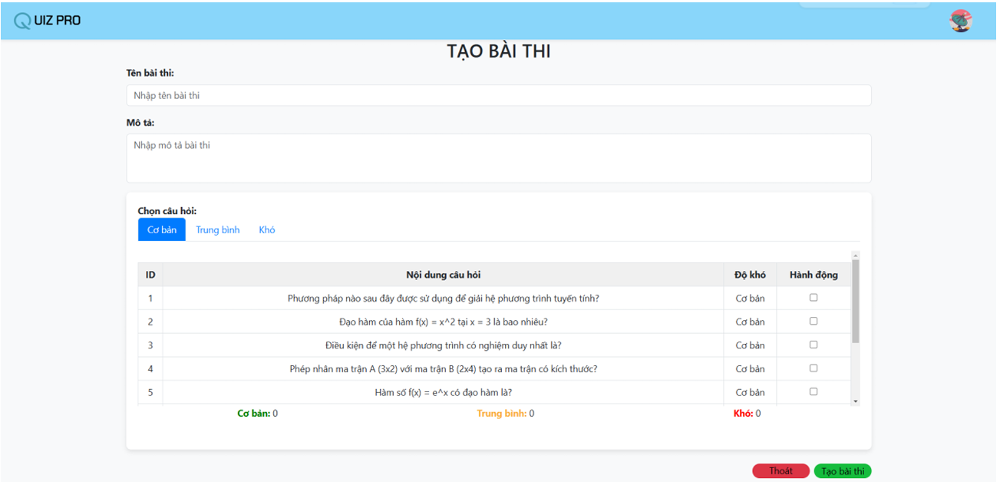

# QuizGame

## Giới thiệu

QuizGame là một hệ thống web cho phép người dùng tham gia các trò chơi trắc nghiệm trực tuyến. Dự án hỗ trợ hai loại người dùng: Client (người chơi) và Host (người tạo/phòng thi). Người chơi có thể đăng ký, đăng nhập, tham gia phòng thi, làm bài kiểm tra và xem kết quả. Người tạo có thể quản lý lớp học, tạo đề thi, quản lý câu hỏi và xem bảng xếp hạng.

## Tính năng chính

- Đăng ký, đăng nhập, đổi mật khẩu cho người dùng
- Quản lý lớp học, thành viên, thông báo
- Tạo, quản lý đề thi và câu hỏi
- Tham gia phòng chờ, bắt đầu thi, xem kết quả
- Bảng xếp hạng theo lớp và theo đề thi
- Giao diện chia thành Client_User và Host_User
- Sử dụng Socket.IO cho các tính năng realtime (phòng chờ, leaderboard)

## Công nghệ sử dụng

- Node.js, Express.js
- MongoDB (Mongoose)
- EJS cho giao diện động
- Socket.IO cho realtime
- Babel cho ES6+
- Multer cho upload file
- dotenv, cors, cookie-parser, jsonwebtoken

## Cấu trúc thư mục

- `src/`: Mã nguồn backend (server, controllers, models, routes, services, middleware, sockets)
- `public/`: Tài nguyên tĩnh (CSS, hình ảnh)
- `views/`: Giao diện EJS cho Client và Host
- `configs/`: Cấu hình database, view engine
- `utils/`: Các thành phần giao diện dùng chung

## Khởi chạy dự án

1. Cài đặt các package:  
   ```
   npm install
   ```

2. Khởi động database

3. Khởi động server:  
   ```
   npm start
   ```
4. Truy cập ứng dụng qua trình duyệt tại địa chỉ được server cung cấp.

## Ảnh chụp từ dự án
- Giao diện trang chủ lớp học:
  

- Giao diện phòng thi:
  

- Giao diện thi
  

- Giao diện bảng xếp hạng (Realtime khi thi)
  

- Giao diện quản lý câu hỏi
  

- Giao diện tạo bài thi
  

- Giao diện quản lý thành viên
  

- Giao diện trang cá nhân
  
